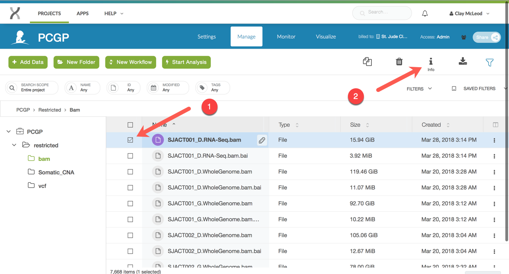

#### Will I be charged for using St. Jude Cloud?

Any copy of the St. Jude data you receive is considered "sponsored",
  so you do not have to pay a fee to store this data in St. Jude
  Cloud. Although you may be prompted to enter billing information, you will not
be charged for anything with the exception of the following actions:

*  You will be charged for any *derivative* files stored on the St. Jude Cloud, such as results files obtained through running analyses workflows.
* There is a small monthly storage fee associated for any of your own data you upload to the cloud.
* If you elect to *download* any data from SJCloud, you will be
  charged an egress fee by DNAnexus. This fee is usually negligible
  unless you are downloading entire cohorts. We are actively
  investigating ways to minimize or eliminate these costs.
* If you run any of our analysis workflows (such as Rapid RNA-Seq, WARDEN, etc) or your own workflows that you have uploaded and packaged into the cloud, you will be charged for the
  compute resources used in producing the results as well as storage
  fees associated with storing the results files.

#### Where can I find the Embargo Date?

All of our samples are marked with an embargo date.
You can find this by looking at the tags for each file or in the
`SAMPLE_INFO.txt` file that is included with each data request.
Select a sample and click info to see more.

#### How can I delete my account?

If you'd like to delete your account, please email DNAnexus support at
<support@dnanexus.com> with the following email.

    Hi DNAnexus,

      Would you please assist me in deleting my St. Jude Cloud account? My username is _____.

    Thank you!

#### Where can I find the Terms of Service or the Privacy Policy?

You can find the Terms of Service
[here](https://stjude.cloud/terms-of-use.html) and the Privacy Policy
[here](https://platform.stjude.cloud/privacy).

[msgen]: https://azure.microsoft.com/en-us/services/genomics/
[gvcf-spec]: https://gatkforums.broadinstitute.org/gatk/discussion/11004/gvcf-genomic-variant-call-format
[gvcf-diff-from-vcf]: https://gatkforums.broadinstitute.org/gatk/discussion/4017/what-is-a-gvcf-and-how-is-it-different-from-a-regular-vcf
