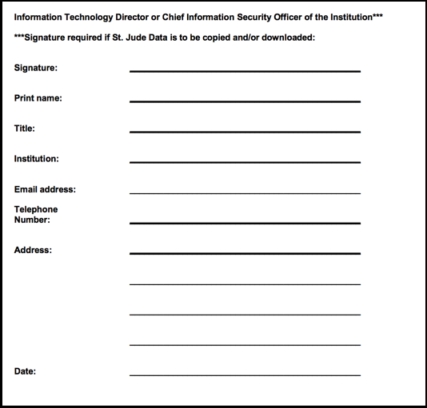

## Introduction

Broadly speaking, the data access agreement (DAA) is a legal document
binding the requestor and the requestor's institution to terms about
how our data may be used. We do not negotiate the terms of this document
unless terms are found to be in conflict with state law. Filling out the
Data Access Agreement carefully and completely is crucial to having your
request filled promptly.

## Filling out the DAA

All Data Access Agreements require the following 5 items:

1. The Data Access Unit(s) you are applying for must be marked (on **page 5**).
    * These can be found in the section Controlled Data, above the Download Data Request
      Form button. This can be found on the third step of the data request
      process under the Controlled Data section. This is a dynamic feature
      that allows the user to see exactly which Data Access Units (datasets)
      they are requesting data from.

     

2. Signature and information of the Principal Investigator. This must be
signed by a Principal Investigator or a faculty-level supervisor on the
project (on **page 8**).

    

3. Signature and information of all other applicants. This should
include any person who will have access to this data. They are legally
bound to protecting and handling the data properly (on **page 9**).

    

4. Signature and information of Institutional or Administrative
Authority (on **page 10**).

    

5. Description of contemplated use of St. Jude data. Here, describe your
research question and it's biological significance. The Contemplated
Use will be evaluated by the Data Access Committees based on the
criteria listed in each of the [committee-protocols]{role="ref"} (on **page 12**).

## Data download permission

Additionally, *if and only if* you would like to *download* the data,
you will also need to include the following:

* The applicant's initials in Part 2 (on **page 4**).

    

* Signature and information of the Information Technology Director or
Chief Information Security Officer (on **page 11**).

    

## Frequently asked questions

**Q. Why do I need to sign this document?**

A. Although the DAA serves many purposes, the terms included in the data access
agreement are ultimately in place to protect our patients. We take
patient security very seriously, and we require that requestors are
committed to protecting that privacy to the fullest extent.

**Q. Where can I find this document?**

You can find this document on the last step of
[request-data]{role="ref"}, or you can download a copy
[here](https://platform.stjude.cloud/access_form).

**Q. Where do I submit this document?**

You can submit this completed document on the last step of
[request-data]{role="ref"}.
