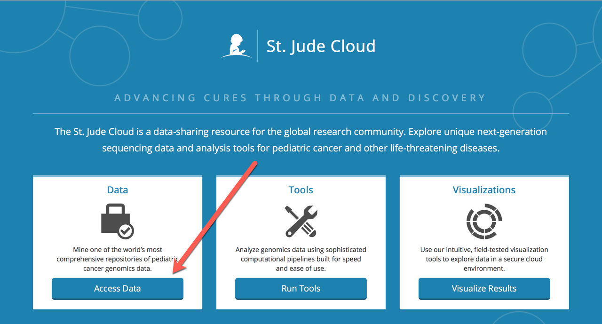
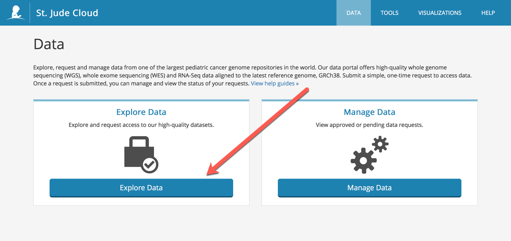
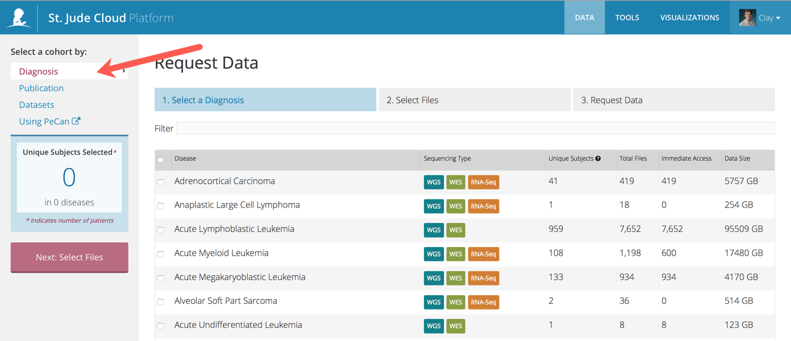
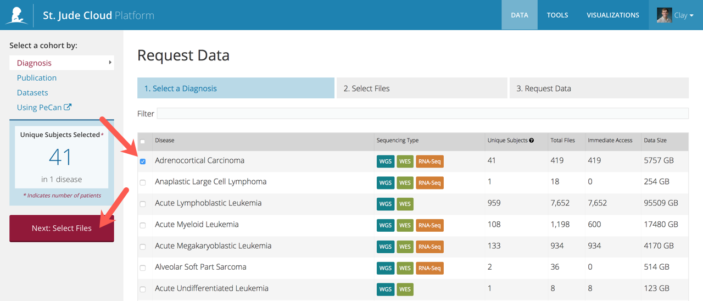

## Introduction

Creating a data request is the premier way to access St. Jude data in 
the cloud. You can get a **free** copy of the data in a secure cloud
environment powered by Microsoft Azure and DNAnexus, or you can elect
to download the data to your local computing environment.

!!! note
    If you would like to download the data to local storage, there are
    extra steps you'll need to follow such as getting extra signatures
    on your data access form. We recommend that you work with the data
    in the cloud if it's feasible! The copy of the data is free, the 
    compute charges are extremely reasonable, and there is no need
    to bother with the long, error-prone downloading process.

### Data access

Data in St. Jude Cloud is grouped into multiple **data access units** (DAUs),
which are independent projects/data sources with different governance structures. 
Each DAU has a separate **data access committee** (DAC) that evaluates incoming 
data requests based on a variety of factors. Access is granted at the DAU level
based on the decision of each DAC. The first time you request access to files in 
a DAU, it is required that you fill out a DAA (which handles contemplated use and
other legally binding terms). After you've been approved once, you can continue
checking out files from that DAU until your access expires (generally after 
1 year) and you need to renew.

### A short example

For example, if you make a request asking for all our St. Jude's Acute 
Lymphoblastic Leukemia sequencing data, you might be asking for data from 
multiple different projects here at St. Jude. For the sake of the example,
let's say the data you want is spread across three different DAUs. Once
you place a request, your application will be routed to the corresponding
three data access committees for approval. Since each DAC is made up of
different individuals using different criteria for evaluation, you may or
may not be approved for access to all of the files.

## Step 0: Navigating to the data browser

Navigate to the data browser by clicking Access Data and Explore
Data. If you would like to view the requests you have already made, you
can do so under Manage Data.

## Step 1: Select a cohort

Next, select the cohort you are interested in requesting. You can
browse our data by different cohorts: disease, publication, dataset, or
you can use PeCan, our Pediatric Cancer portal to find samples
associated with specific genes, or mutations. 

!!! todo
    This screenshot needs updating.

## Step 2: Select which files you want

Once you have selected the cohort you would like to study, you can chose what
type of files you would like to receive. This step is dynamic, and shows
you all of the file types we have available for the dataset you are
interested in.

## Step 3: Submit your data request

If you are requesting access to a dataset you have not already been approved for, 
you will see a section called Controlled Data. Under this section, there is a bulleted list
that indicates the Data Access Units you need to request access to through our data
access agreement. Please use this list to fill in the Datasets section of the Data Request
Form as shown in the figure below. For more information on filling out this guide,
see [Filling out the DAA]data-access-agreement.md#filling-out-the-daa).

Now, you have successfully submitted your data request. Your request
will be sent to the respective data access committees for evaluation.
You should expect to hear from us within a week or two on average. 