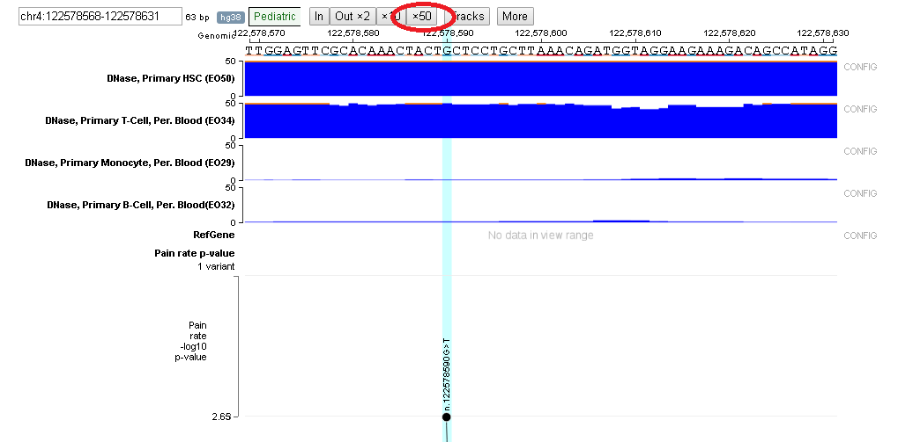
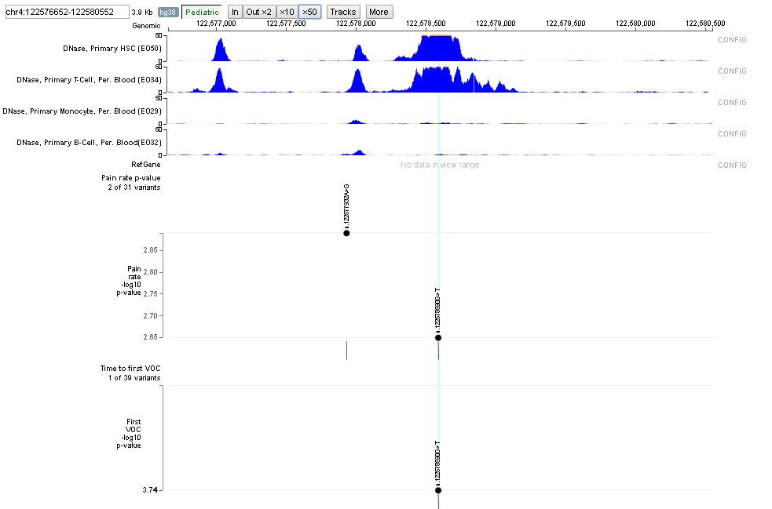
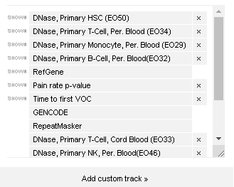
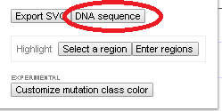
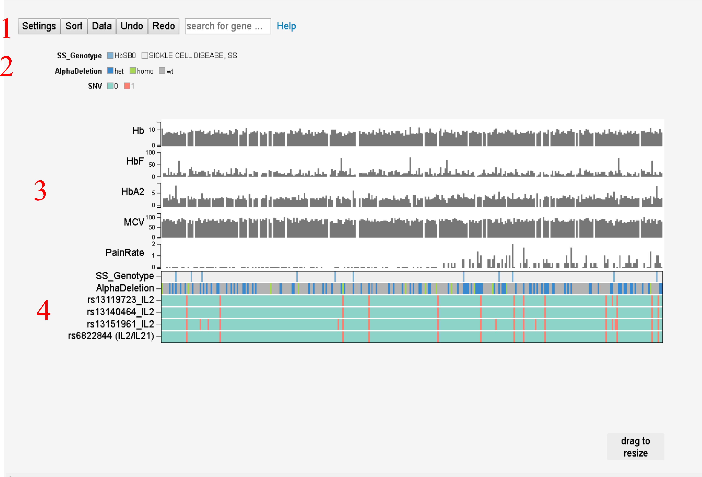
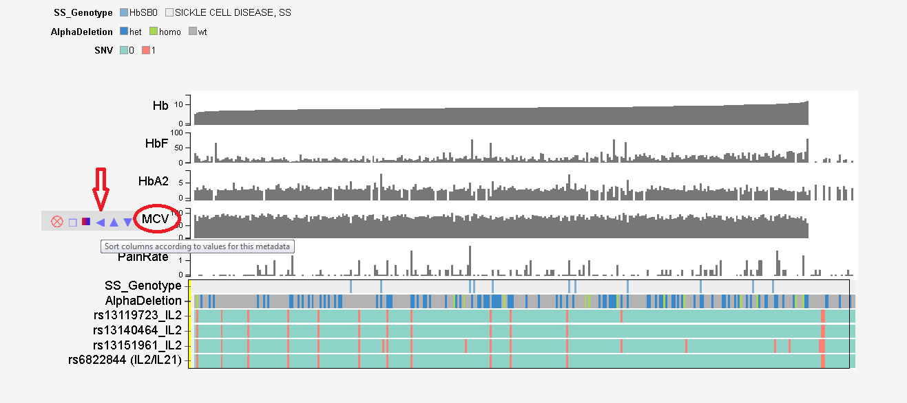
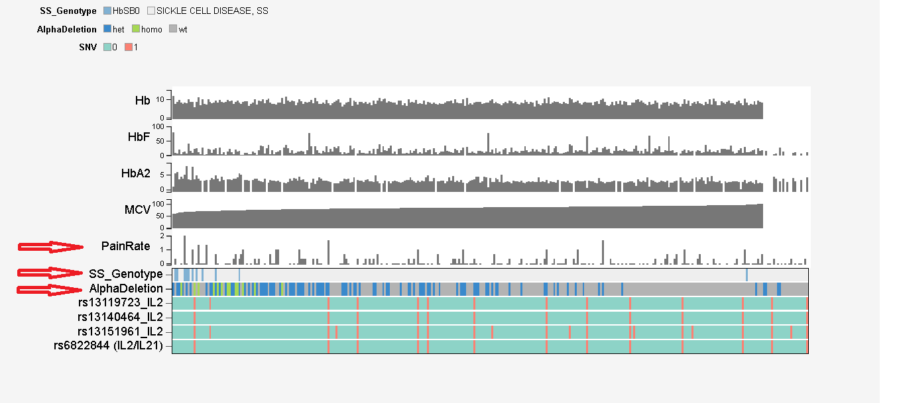
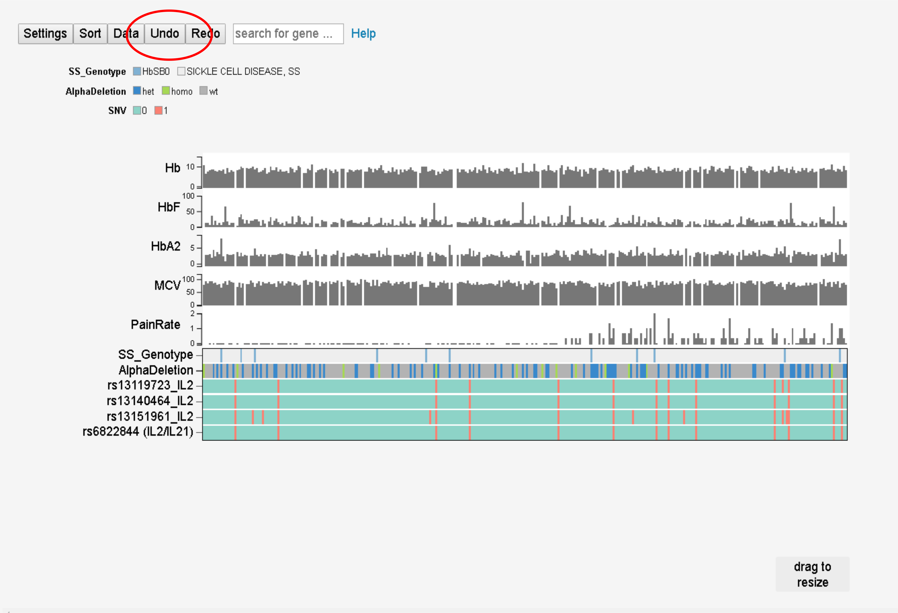

The Sickle Cell Genomics Portal contains two viewers for the exploration of data from the  [Sickle Cell Genome Project (SGP)](../glossary/data-access-unit#sickle-cell-genome-project-sgp) dataset.

## Genome Browser

### Overview
Upon launching the browser, you will see an image similar to the one shown here.

A description of the elements of the browser are as follows:

|#   |      Description      |  
|----------|-------------|
| 1| Navigation tools and track selector. ([See Navigation Buttons section](#navigation-buttons))  | 
|2|    DNase hypersensitivity tracks.  By default, four epigenetic tracks are shown.  These are DNAse hypersensitivity tracks for Hematopoeitic stem cells (HSC), T Cells, Monocytes, and B Cells.  Additional tracks can be viewed by selecting the ‘Tracks’ button (See Adding/Removing Tracks section below)  |  
|3 | RefSeq genes.  Gene models from the RefSeq database are displayed in this tracks. | 
|4 |-log10 of the p-value of the association of each variants with pain rate in individuals with Sickle Cell Disease.  The analysis has only been performed around the  KIAA1109/Tenr/IL2/IL21 region.   Each dot on the track represents a genomic variant (Single Nucleotide Variant (SNV) or small insertion/deletion (INDEL)).  The Y-axis for the track represents the -log10 of the p-value.  The higher the value, the more statistically significant the association between the variant and pain rate is.  Clicking on a variant will open op a window that gives further details about the variant.  (See Figure 3). | 
|5 | -log10 of the p-value of the association of each variants with age of first vaso-occlusive crisis in individuals with Sickle Cell Disease.  See (4) above for more information on this type of track. | 
|6| Filters: Filters allow variants within tracks to be filtered by numerous citeria.  [See Filter description](#filters)|

### Navigation buttons

|#   |      Description      |  
|----------|-------------|
| a|Location/Locus entry field.  One can enter genomic coordinates in the form of chromosome:start-end (for example chr1:12345-9876), or a gene name or a SNP rs ID. | 
|b|   Browser zoom in and out |  
|c | Tracks: Add or hide tracks (See section below on adding/hiding tracks) | 
|d |More:  Save svg image of browser, get DNA sequence or highlight regions of the browser. | 

### Filters

|#   |      Description      |  
|----------|-------------|
| a| Filters for pain rate p-value track | 
|b|  Filters for age of first vaso-occlusive crisis (VOC) p-value |  
|c | The highlighted filter shows which value is  used for the Y-axis on the browser track.  The value can be changed. | 
|d | A highlighted value within a filter shows which filter value is set.  The number next to the filter represents the number of individuals that meet the filter criteria.| 

### Getting Started

#### Finding a variant of interest
A user can navigate to a gene or to a variant ID.
Enter in the variant ID rs13140464 into the search text field at the top of the browser. (See below)

Pressing enter will center the browser of the selected variant.  (see below)

#### Zooming in and out
One can use the buttons next to the search field to zoom in and out along the genome.  Press the x50 button to zoom out 50 fold

This will show a larger region of the chromosome.

One can now see three DNase peaks (1) around the rs13140464 variant(2).  In addition there is another variant (3) seen near one of the DNase peaks.

#### Obtaining additional variant information
Left clicking a variant (see red circle below), will cause a new window to pop up in the browser that will contain additional information about the variant.

#### Adding and removing tracks
Select the tracks button from the top of the genome browser.

A window displaying selected tracks and tracks available for selection will pop up.

One can scroll down to see additional tracks.  Try selecting and unselecting various tracks and observe the updated tracks on the browser.

#### Getting DNA sequence
Select the 'More' button at the top of the browser.

Several options will be available.  Select the DNA sequence button.

You will be shown the DNA sequence for the region.

## Variants and Phenotype Viewer

### Overview

When the Variants and Phenotype Viewer is launched, the user will be presented with the following visualization.

The different elements of the view are as follows.

|#   |      Description      |  
|----------|-------------|
| 1| Settings and sort buttons.  In addition a link to this help document. | 
|2|  Legend for different tracks in the viewer |  
|3 | Phenotypic data displayed with an individual represented in each column | 
|4 | Genotypic data displayed with an individual represented in each column | 

### Labels
[See glossary for further details](#glossary)

|#   |      Description      |  
|----------|-------------|
| Hb | Hemoglobin | 
|HbF| [Fetal Hemoglobin](#hbf) |  
|HbA2 | Variant of hemoglobin that contains two alpha subunits and two delta subunits | 
|MCV | Mean corpuscular  volume. This is the average size of red blood cells | 
|PainRate |Number of hospitalizations per year over a two year period. | 
|Sickle cell genotype | (SS_Genotype in legend.  Whether patient is SS or SB0 | 
|Alpha deletion | Whether the individual has an alpha globin deletion (het=1 deleted allele, homo=2 deleted alleles) |
|rs###### | Several variants that we have found to be associated with pain in Sickle Cell Disease|

### Getting Started

#### Sorting
Hover your mouse over the MCV label in the graph.  A box will pop up with several icons.  Select the triangle that is pointed to the left to sort individuals by MCV.

The following graph shows individuals sorted by MCV.  Blank columns represent no data available.  Note that PainRate, Sickle cell genotype and alpha deletion status appear to correlate with MCV values.

#### View values for all patients
Hovering over one column will enable the viewing of all phenotypic values for that patient.

#### Undo
While exploring the data, one may inadvertently sort or remove data.  One can undo the changes by selecting the undo button at the top of the viewer.  The redo button will revert the undo.

## Glossary 

* **Fetal hemoglobin (HbF)**
Fetal hemoglobin contains two subunits of gamma-globin and two units of alpha-globin, while adult hemoglobin contains two subunits of beta-globin and two units of alpha-globin. 

* **Heriditary persistence of fetal hemoglobin (HPFH)**
Individuals with HPFH have elevated levels of fetal hemoglobin. These elevated levels reduce or eliminate many of the symptoms of Sickle Cell Disease.

* **Principal Component Analysis (PCA)**
A [method](https://www.jmp.com/support/help/14/principal-components.shtml) for reducing high dimensional data into low-dimensional representations.

* **SC**
An individual with one copy of the sickle cell allele [rs334](https://www.ncbi.nlm.nih.gov/snp/rs334) and one copy of [hemoglobin C](https://medlineplus.gov/ency/article/000572.htm).

* **S&beta;+**
An individual with [beta-thalassemia](https://ghr.nlm.nih.gov/condition/beta-thalassemia) who has one copy of the sickle cell allele [rs334](https://www.ncbi.nlm.nih.gov/snp/rs334) and one copy of a beta-globin gene that has reduced expression.

* **S&beta;0**
An individual with [beta-thalassemia](https://ghr.nlm.nih.gov/condition/beta-thalassemia) who has one copy of the sickle cell allele [rs334](https://www.ncbi.nlm.nih.gov/snp/rs334) and one copy of a beta-globin gene that is not expressed or is deleted.

* **SS** 
An individual with [sickle cell disease](https://ghr.nlm.nih.gov/condition/sickle-cell-disease) who is homozygous for the sickle cell allele [rs334](https://www.ncbi.nlm.nih.gov/snp/rs334).

* **SCCRIP**
The [Sickle Cell Research and Intervention Program](https://www.stjude.org/research/clinical-trials/sccrip-hematological-disorder.html).