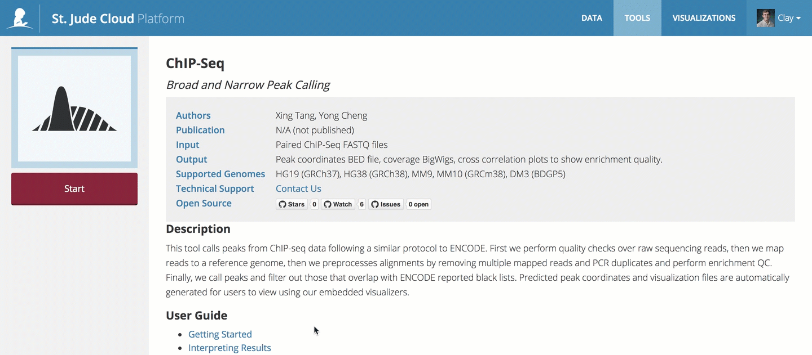
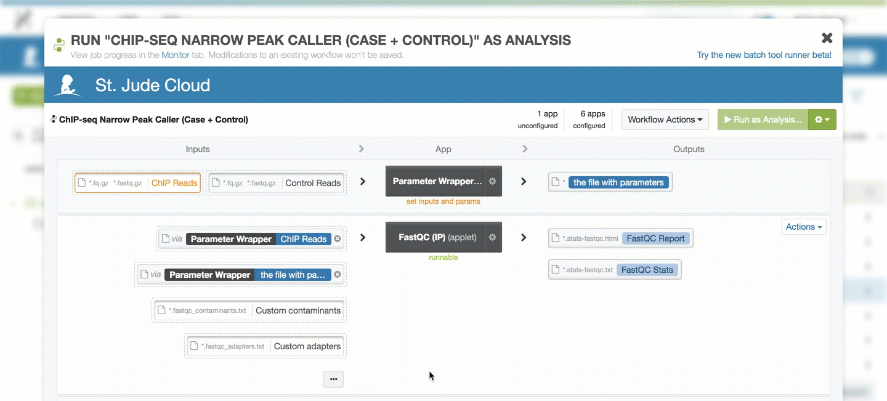
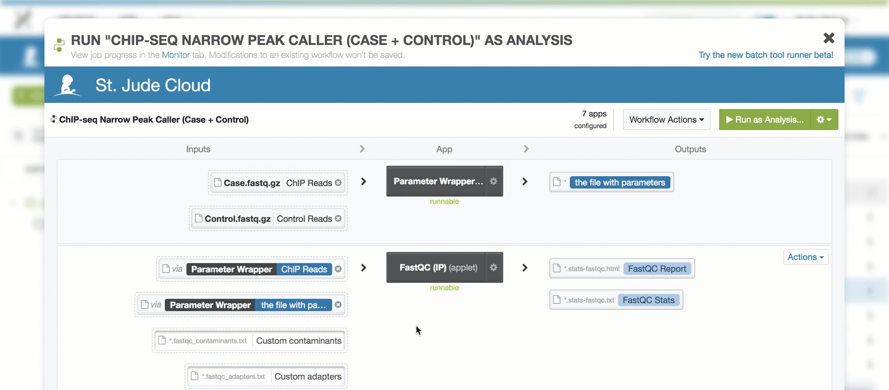
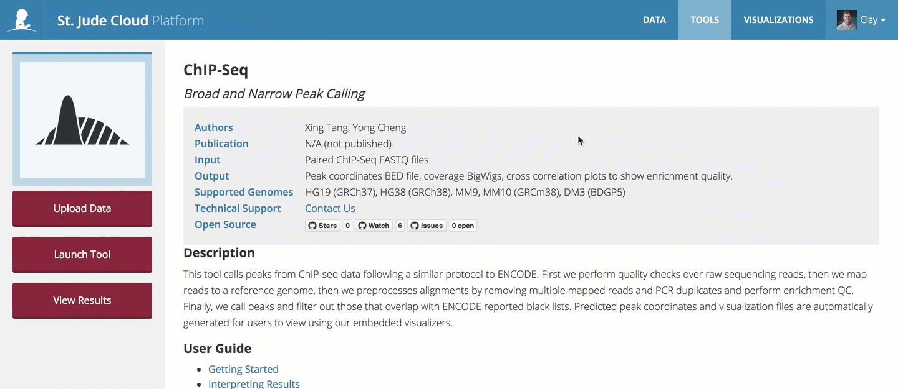
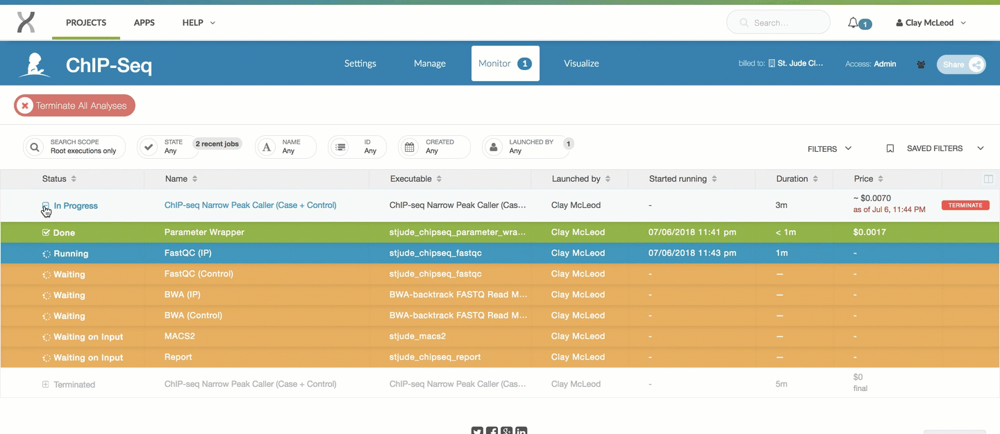
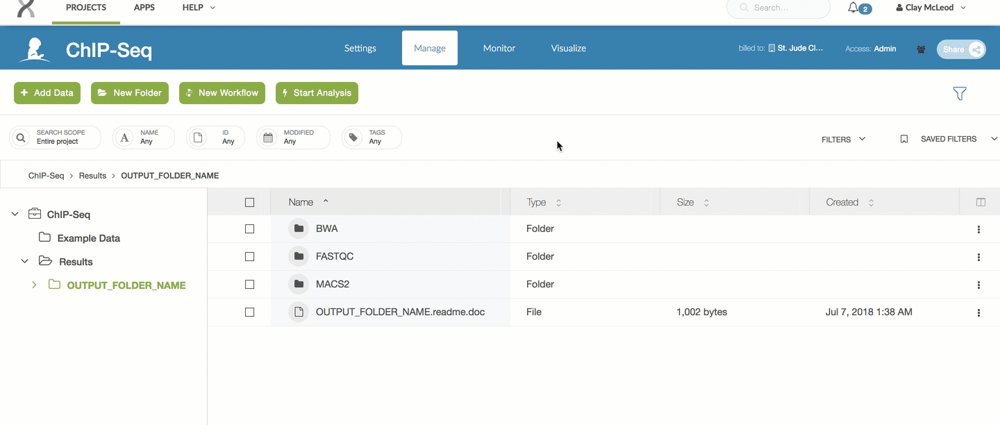

| | | 
|-------------|-----------------------|
| **Authors** | Xing Tang, Yong Cheng |
| **Publication** | N/A (not published) |
| **Technical Support** | [Contact Us](https://stjude.cloud/contact) |

The ChIP-Seq Peak Calling workflow follows ENCODE best practices to call 
broad or narrow peaks on Illumina-genearted ChIP-Seq data. 
Here, a Gzipped FastQ file from an Immunoprecipitation (IP) experiment 
is considered the "case sample file" and a Gzipped FastQ file from a control 
experiment is considered the "control sample file". The pipeline can on
matched case/control samples (recommended for better results) or just a 
case sample.

## Overview

**Inputs**

!!! todo
    Write ChIP-Seq inputs section.

**Outputs**

!!! todo
    Write ChIP-Seq outputs section.

**Process**

1. The reads of the FastQ file(s) are aligned to the specified reference genome. 
2. The aligned reads are then post-processed based on best-practice QC techniques
(removing multiple mapped reads, removing duplicated reads, etc). 
3. Peaks are called by SICER (broad peak analysis) or MACS2 (narrow peak
analysis). 
    * Qualified peaks will be output BED (.bed) and big BED (.bb)
files. 
    * The coverage information will be output as a bigWig (.bw)
file with an accompanying visualization by ProteinPaint. 
    * A cross correlation plot and general metrics file are generated to help check
the quality of experiment.

## Getting started

To get started, you need to navigate to the [ChIP-Seq tool page](https://platform.stjude.cloud/tools/chip-seq). You'll need to click
the "Start" button in the left hand pane. This creates a cloud workspace
in DNAnexus with the same name as the tool. After this, you will be able 
to upload your input files to that workspace.

!!! note
    If you can't see the "Start" button, one of these two scenarios is likely the case:

    * You see three buttons on the left sidebar instead of one. In this case,
      you've already clicked the "Start" button previously, and a cloud workspace has
      already been created for you. In this case, you're good! You can move
      on to the next section.
    * If you cannot see *any* buttons on the left side, you probably have not
      logged in yet. If you see a sentence that says "Log in to launch this 
      tool", simply login and try again.

    If neither of these are the case and you still can't click "Start",
    [contact us](https://stjude.cloud/contact).

## Uploading data

The ChIP-Seq Peak Caller takes Gzipped FastQ files generated from an
IP experiment as input. You can upload your input FastQ files by
using the [data transfer application](../data/data-transfer-app.md)
or by uploading them through [the command line](../data/command-line.md).
Both of the guides linked here will contain more details on how to upload
data using that method, so we defer to those guides here.

!!! tip
    If you plan to upload data through the St. Jude Cloud Data Transfer application
    (recommended), you can click the "Upload Data" button in the left panel. If you
    have not already downloaded the app, do so by clicking "Download app". Once you
    have the app, you can click "Open app" to open the app with the tool's cloud 
    workspace already opened and ready to drag-and-drop files into it!

    For more information, check out the [data transfer application](../data/data-transfer-app.md) guide.

## Running the tool

Once you've uploaded data to your cloud workspace, 
click "Launch Tool" on the [tool's landing page](https://platform.stjude.cloud/tools/chip-seq). 
A dropdown will present the different presets for running the ChIP-Seq workflow.
You'll need to decide **(1)** whether you'd like to run broad/narrow peak
calling and **(2)** whether you have a case sample and a control sample (preferred)
or just a case sample. This will determine which preset you should
click in this dropdown. There are various other parameters that you can 
set, but they are covered in further sections of this guide.

### Broad vs. narrow peak calling

Choosing between broad and narrow peak calling depends on the experiment
design. The following are good rules of thumb for choosing between the
two configurations. If you are not sure which configuration to use,
please consult with an expert at your institution or [contact us](https://stjude.cloud/contact).

**Narrow Peak Calling**

If your target protein is a transcription factor, you should probably
choose narrow peak calling. You can also try the narrow peak calling
workflows for the following histone marks:

* H3K4me3
* H3K4me2
* H3K9-14ac
* H3K27ac
* H2A.Z

**Broad Peak Calling**

You should try the broad peak calling workflows for the following
histone marks:

* H3K36me3
* H3K79me2
* H3K27me3
* H3K9me3
* H3K9me1

**Special Cases**

In some scenarios, H3K4me1, H3K9me2 and H3K9me3 might behave between
narrow and broad shape, you might need to look into each peak region and
consult experts.

!!! warning
    If your fragment size is less than 50 base pairs, please refer to the
    [frequently asked questions](#frequently-asked-questions).

### Selecting parameters

There are a number of other parameters that can be customized. To 
see the options available, click the gear cog next to the 
"Parameter Wrapper" substep.

The following are the parameters that can be set, a short
description of each parameter, and an example value. If you
have question, please [contact us](https://stjude.cloud/contact).

| Parameter Name | Description | Example |
|--|--|--|
| Output prefix (*required*) | A name used a prefix for all outputs in the run | SAMPLE1 |
| Reference genome (*required*) | Supported reference genome from one of HG19, HG38, mm9, mm10, dm3 | HG38 |
| Output bigWig | Whether or not to include a bigwig file in the output | True |
| Remove blacklist peaks | Whether or not to remove known problem areas | True |
| Fragment length | Hardcoded fragment length of your reads. 'NA' for auto-detect. | NA |

!!! caution
    Please be aware of the following stumbling points when setting parameters:

    * Do not use spaces anywhere in your input file names, your output
      prefix, or any of the other parameters. This is generally bad
      practice and doesn't play well with the pipeline (consider using
      "_" instead).
    * Do not change the output directory when you run the pipeline. At
      the top of parameter input page, there is a text box that allows
      you to change the output folder. **Please ignore that setting**. You
      only need to specify an output prefix as described aboce. All of
      the results will be put under `/Results/[OUTPUT_PREFIX]`.

### Hooking up inputs

Next, you'll need to hook up the FastQ files you uploaded in 
[the upload data section](#uploading-data). You can do this by 
clicking on the `ChIP Reads` and `Control Reads` slots and
selecting the respective files. If you are not doing a case/control
run, you only need to hook up the case sample.

### Starting the workflow

Once your input files are hooked up, you should be able to start the workflow
by clicking the "Run as Analysis..." button in the top right hand corner
of the workflow dialog.

!!! tip 
    If you cannot click this button, please ensure that:

    * all of the inputs are correctly hooked up (see [hooking up inputs](#hooking-up-inputs)), and 
    * all of the required parameters are set (see [setting parameters](#setting-parameters)).

    If you're still have trouble, please [contact us](https://stjude.cloud/contact) and include
    a screenshot of the workflow screen above.

## Monitoring run progress

Once you have started one or more ChIP-Seq runs, you can safely close your
browser and come back later to check the status of the jobs. To do this,
navigate to the [tool's landing page](https://platform.stjude.cloud/tools/chip-seq). 
Next, click "View Results" then select the "View Running Jobs" option. 
You will be redirected to the job monitoring page. Each job you kicked off
gets one row in this table.

 

You can click the "+" on any of the runs to check 
the status of individual steps of the ChIP-Seq pipeline.
Other information, such as time, cost of individual steps in the pipeline, 
and even viewing the job logs can accessed by clicking around the sub-items.

 

!!! tip 
    Power users can view the [DNAnexus Job Monitoring Tutorial](https://wiki.dnanexus.com/UI/Jobs) and the [DNAnexus Command Line Tutorial for Job Monitoring](https://wiki.dnanexus.com/Command-Line-Client/Monitoring-Executions) for advanced capabilities for monitoring jobs.

## Analysis of results

Each tool in St. Jude Cloud produces a visualization that makes understanding
results more accessible than working with excel spreadsheet or tab delimited
files. This is the primary way we recommend you work with your results. We also
include the raw output files for you to dig into if the visualization is not 
sufficient to answer your research question.

### Interactive visualizations

Today, the ChIP-Seq pipeline does not produce an interactive visualization. We are
working on adding this! In the meantime, you can view the cross-correlation plot(s)
as outlined in the sections below.

### Finding the raw results files

Navigate to the [tool's landing page](https://platform.stjude.cloud/tools/chip-seq). 
In the left hand pane, click "View Results" then "View Results Files". You will
be taken to the filesystem view your cloud workspace. This is similar to your the
filesystem on your computer, and you can do many common operations such as deleting,
renaming, and moving files. To access ChIP-Seq results, you should click on the 
`Results` folder, then select the output folder name you gave in the [selecting parameters](#selecting-parameters) part of the guide.

### Interpreting results

For the ChIP-Seq pipeline, every pipeline run outputs a `README.doc` file
which contains the latest information on which results are included.
You can refer to that file for the most up to date information on raw outputs.

## Frequently asked questions

If you have any questions not covered here, feel free to 
[contact us](https://hospital.stjude.org/apps/forms/fb/st-jude-cloud-contact/).

**Q: Should I choose narrow peak calling pipeline or broad peak calling pipeline?**

A. We built two workflows: one for narrow peak calling and another broad
peak calling. If your target protein is a transcription factor, please
use narrow peak calling workflow. For histone marks H3K4me3, H3K4me2,
H3K9-14ac, H3K27ac and H2A.Z, you could try narrow peak calling
workflow. For histone marks H3K36me3, H3K79me2, H3K27me3, H3K9me3 and
H3K9me1, you could try broad peak calling workflow. In some scenario,
H3K4me1, H3K9me2 and H3K9me3 might behave between narrow and broad
shape, you might need to look into each peak region and consult
experts.

**Q. What to do if your fragment size is less than 50 base pairs?**

A. We estimate fragment size from the data based on the cross correlation
plot. Usually the fragment size is above 50bp. If the estimated
fragment size lower than 50bp, the workflow will stop at the peak
calling stage (MACS2/SICER) after BWA mapping finishes. You can rerun
the analysis with a specified fragment length.