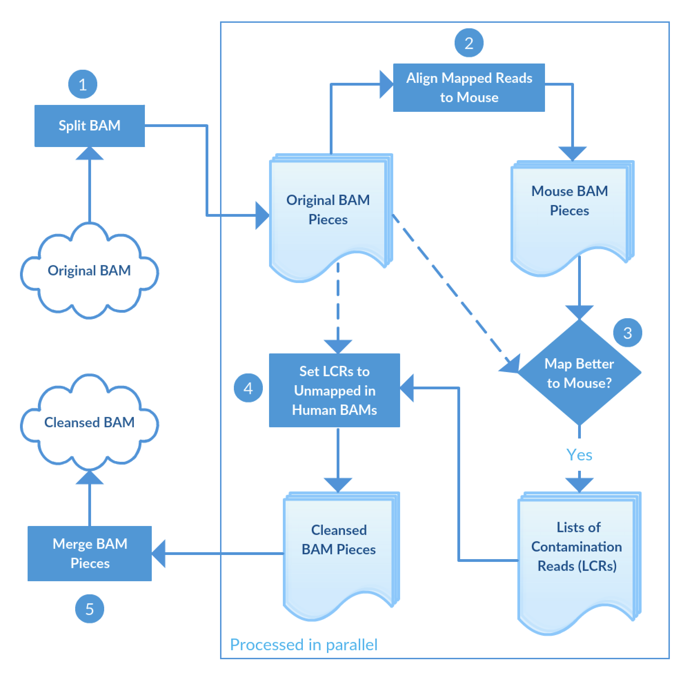

|                         |                                            |
|-------------------------|--------------------------------------------|
| **Authors**             | Michael Rusch, Liang Ding, Michael Macias  |
| **Publication**         | N/A                                   |
| **Technical Support**   | [Contact Us](https://stjude.cloud/contact) |

XenoCP is a tool that can be used to find and remove contaminating mouse read sequences within a xenograft BAM alignment file aligned to a human genome reference. This is achieved by identifying the source of reads via alignment to human and mouse genomes. 
XenoCP can be easily incorporated into any workflow as it takes a BAM file 
as input, removes mouse sequence contamination, and outputs a "cleansed" 
 BAM file only containing human mapped read sequences. This cleansed output BAM file can be used for downstream genomic analysis.

XenoCP supports hg19 (GRCh37) and mm9 (MGSCv37).

## Overview

<h3 id="process">Process</h3>

XenoCP workflow contains the following five steps (see diagram below):

  1. Split input human BAM file into given number of small pieces.
  2. Align mapped reads to mouse reference genome.
  3. Compare human and mouse alignments and identify read identity.
  4. Create lists of contamination reads and set them to unmapped in human BAMs.
  5. Merge the BAM pieces to a cleansed BAM.

Note that steps 2-4 run in parallel.

<h3 id="inputs">Inputs</h3>

| Name                           | Type           | Description                                                                                  | Example               |
|--------------------------------|----------------|----------------------------------------------------------------------------------------------|-----------------------|
| BAM                            | File           | Input bam aligned to human reference genome. [required]                                      |`test.bam`, `test.bam.bai`|
| [Reference DB Prefix]          | String         | Basename of the input human reference assembly. [required]                                   | MGSCv37.fa            |
| Suffix Length                  | Integer        | Mate suffix length. [default: 4]                                                             | 4                     |
| Keep Mates Together            | Boolean        | Whether to keep mates (read pairs) together [default: True]                                               | True                  |
| Bucket Number                  | Integer        | Number of buckets [default: 31]                                                              | 15                    |
| Validation Stringency          | String         | Validation stringency: STRICT, LENIENT, SILENT [default: SILENT]                             | SILENT                |
| Output Prefix                  | String         | Prefix to append to output filenames [default: xenocp-]                                      | xenocp-               |
| Output Extension               | String         | Output file extension [default: bam]                                                         | bam                   |
| Sort Order                     | String         | Read sort order [default: queryname]                                                         | queryname             |

[Reference DB Prefix]: #db-prefix

<h3 id="outputs">Outputs</h3>

| Name                       | Type | Description                                                                        |
|----------------------------|------|------------------------------------------------------------------------------------|
| [Cleansed BAM]             | File | Cleansed BAM                                                                       |
| [Tie BAMs]                 | Files| BAMs with reads being classified as either human or mouse                          |
| [Contamination lists]      | Files| Tab-delimited file (no headers) with sample ID and tag pairs                       |

## Getting started

After logging in, click the "Start" button on the [XenoCP tool
page]. This creates a new DNAnexus project and imports the tool.

With subsequent runs, the sidebar shows "Launch Tool", meaning the project with
the tool already exists. Click "Launch Tool" to start a new analysis.

[XenoCP tool page]: https://platform.stjude.cloud/tools/xenocp

### Input configuration

XenoCP requires two inputs: a BAM file aligned to human reference genome and 
the basename of the input human reference assembly. All other inputs are optional.

Input files can be uploaded via the [data transfer application] or [command
line].

[data transfer application]: ../data/data-transfer-app.md
[command line]: ../data/command-line.md

<h4 id="bam">BAM</h4>

Input BAM aligned to a human reference genome.

<h4 id="db-prefix">Reference DB prefix</h4>

Basename of the input human reference assembly. For example, a prefix of
MGSCv37.fa would assume the following files in the same directory exist: MGSCv37.fa, 
MGSCv37.fa.amb, MGSCv37.fa.ann, MGSCv37.fa.bwt, MGSCv37.fa.dict, MGSCv37.fa.fai, 
MGSCv37.fa.pac, and MGSCv37.fa.sa.

<h4 id="output-prefix">Output prefix</h4>

_Output prefix_ is the prefix to append to the output contamination and tie filenames. "xenocp-" is the default prefix. 

<h5>Example</h5>

| Output Prefix                  | Output filename for raw signatures       |
|-------------------------|------------------------------------------|
| xenocp-                 | `xenocp-000.contam.txt`                  |
| xenocp-                 | `xenocp-000.tie.bam`                     |

<h4 id="disabled-vcf-column">Bucket Number</h4>

Number of small bam pieces that an input bam is split to. This should be less than the number of cores of the instance type. As 
the default instance type is azure:mem2_ssd1_x16, default bucket number is 15.

## Uploading input data files
XenoCP requires at least one BAM along with its BAI files
to be uploaded. These files can be uploaded via the [data transfer
application] or [command line].

[data transfer application]: ../data/data-transfer-app.md
[command line]: ../data/command-line.md

## Analysis of results

Upon a successful run of XenoCP, a cleansed BAM file, a list of contamination reads and a list of tie BAMs
 are saved to your working directory.

### Interpreting results

<h4 id="cleansed-bam">Cleansed BAM</h4>

Cleansed BAM is the major output of XenoCP workflow. The mapped reads in this BAM file are of human origin (including reads in tie BAM) and are mapped to the human genome reference sequence. Any reads deemed to originate from mouse by XenoCP are set to 'unmapped'.

<h4 id="contam-list">Contamination files</h4>

Each contamination file is a plain txt file containing a list of read names cleansed from a "BAM piece" (see process diagram above).

<h4 id="tie-bam">Tie BAM</h4>

Each "tie BAM" contains a list of reads that do not have clear read identity. These reads are kept as mapped in the cleansed BAM file.
Reads in a tie BAM are aligned to the human reference genome.

## References

  * The manuscript associated with XenoCP will be submitted to bioXriv shortly.
   
[xenocp]: https://github.com/stjude/xenocp
